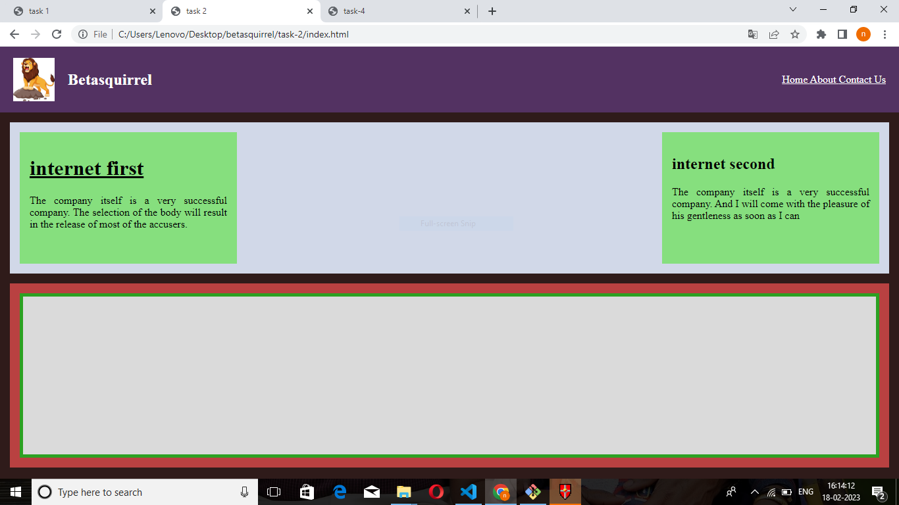
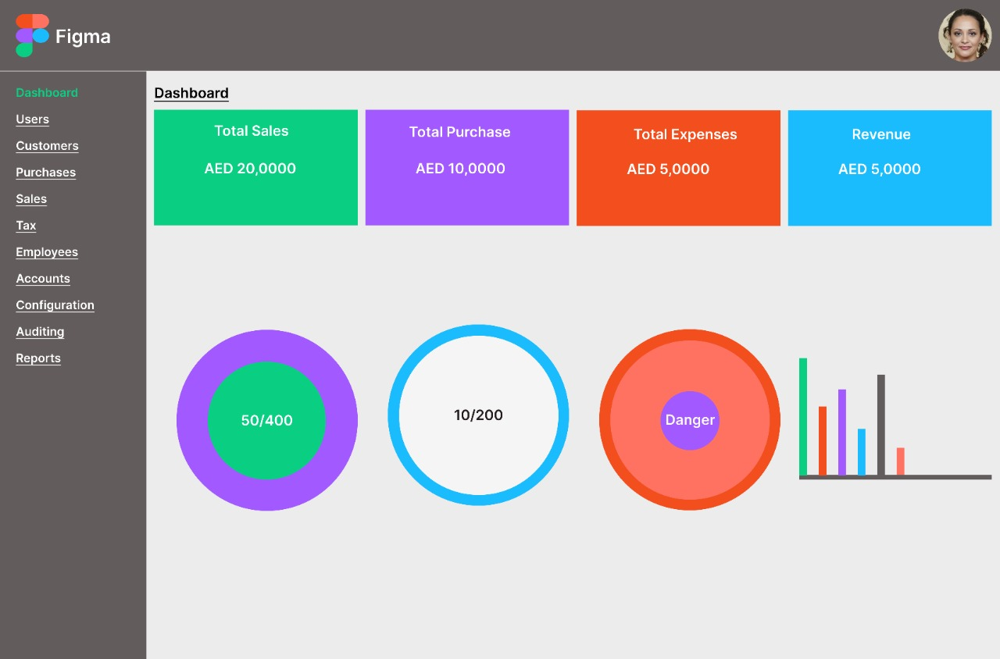
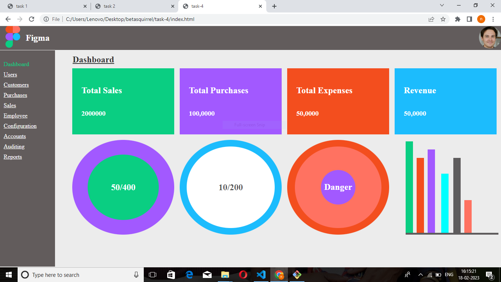

# betasquirrel-tasks

Assignments from betasquirrel

## Coding-task

### Requirements

| requirements                 | output                         |
| ---------------------------- | ------------------------------ |
|  |  |
|  |  |
|  |  |

Read the below pages and attend the tests.

- [HTML](https://www.w3schools.com/w3css/defaulT.asp)
- [HTML INTRODUCTION](https://www.w3schools.com/html/html_intro.asp)
- [HTML EDITORS](https://www.w3schools.com/html/html_editors.asp)
- [HTML BASIC](https://www.w3schools.com/html/html_basic.asp)
- [HTML ELEMENTS](https://www.w3schools.com/html/html_elements.asp)
- [HTML ATTRIBUTES](https://www.w3schools.com/html/html_attributes.asp)
- [HTML HEADINGS](https://www.w3schools.com/html/html_headings.asp)
- [HTMLPARAGRAPHS](https://www.w3schools.com/html/html_paragraphs.asp)
- [HTML STYLES](https://www.w3schools.com/html/html_styles.asp)
- [HTML FORMATTING](https://www.w3schools.com/html/html_formatting.asp)
- [HTML QUOTATIONS](https://www.w3schools.com/html/html_quotation_elements.asp)
- [HTML COMMENTS](https://www.w3schools.com/html/html_comments.asp)
- [HTML COLORS](https://www.w3schools.com/html/html_colors.asp)
- [HTML CSS](https://www.w3schools.com/html/html_css.asp)
- [HTML LINKS](https://www.w3schools.com/html/html_links.asp)
- [HTML IMAGES](https://www.w3schools.com/html/html_images.asp)
- [HTML FAVICON](https://www.w3schools.com/html/html_favicon.asp)
- [HTML TABLES](https://www.w3schools.com/html/html_tables.asp)
- [HTML CLASSES](https://www.w3schools.com/html/html_classes.asp)
- [HTML ID](https://www.w3schools.com/html/html_id.asp)

## Linux commands

- `cd` -Change current directory. Ex:`cd desktop`, `cd ..`
- `ls` -List contents of a directory. Ex: `ls -a` list hidden files as well.
- `pwd` -Display current working directory path
- `cat` -Display contents of a file. Ex: `cat README.md`
- `mkdir` -To creat one or more directories.
- `clear` -To clear git bash.
- `rm` -To remove file.

## GIT commands

1. `git config` configure git user. Ex: `git config --global user.name "nithune312", git config user.email` `nithune312@gmail.com`
2. `git clone` clone a remote git repo to your local. Ex: `git clone https://github.com/nithune312/betasquirrel-tasks.git`
3. `git add`Add your file changes to git. Ex: `git add ..`
4. `git commit`commit changes to git. Ex: `git commit -m "Initial commit"`
5. `git push`Push your local commits to remote repo. Ex: `git push origin main`
6. `git stash`takes your uncommitted changes,saves them away for later use,and then reverts them from working copy.
7. `git pull`is used to fetch and download content from a remote repository and immediately update the local repository to match that content.
8. `git diff`helps you see,compare,and understand changes in your project.

Task 5

- [HTML Favicon](https://www.w3schools.com/html/html_favicon.asp)
- [HTML Tables](https://www.w3schools.com/html/html_tables.asp)
- [HTML Table borders](https://www.w3schools.com/html/html_table_borders.asp)
- [HTML Table sizes](https://www.w3schools.com/html/html_table_sizes.asp)
- [HTML Table headers](https://www.w3schools.com/html/html_table_headers.asp)
- [HTML Table padding and spacing](https://www.w3schools.com/html/html_table_padding_spacing.asp)
- [HTML Table colspan and rowspan](https://www.w3schools.com/html/html_table_colspan_rowspan.asp)
- [HTML Table styling](https://www.w3schools.com/html/html_table_styling.asp)
- [HTML Table colgroup](https://www.w3schools.com/html/html_table_colgroup.asp)

my website

https://nithune312.github.io/betasquirrel-tasks/

my stackoverflow link

https://stackoverflow.com/users/21210149/nithun-e

my linkdin link

https://www.linkedin.com/in/nithun-e-25a267266/
