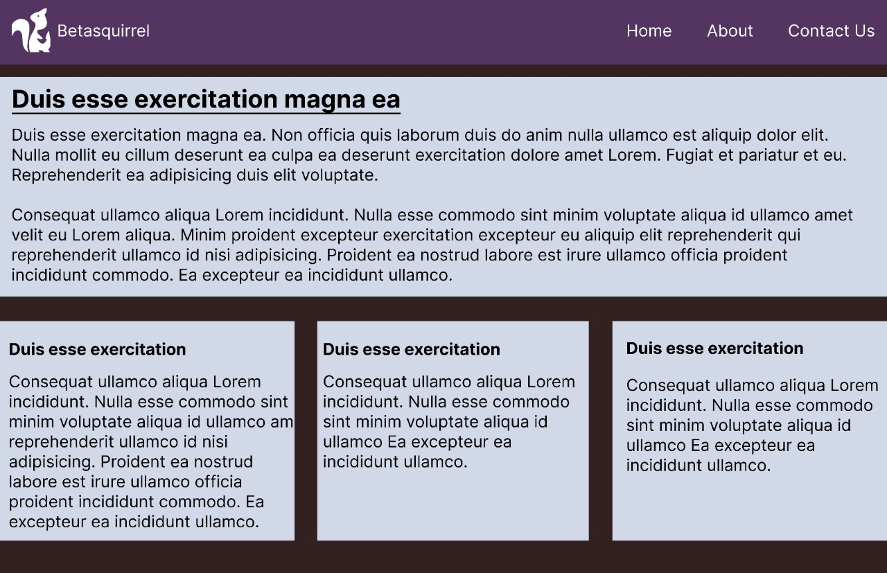
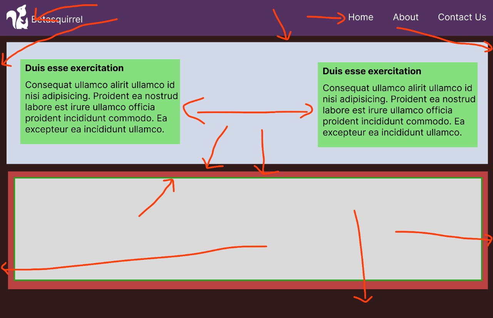

# betasquirrel-tasks

Assignments from betasquirrel

## output

|output                           |
|.................................|
|     |
|     |

Read the below pages and attend the tests.

- [HTML](https://www.w3schools.com/w3css/defaulT.asp)
- [HTMLI INTRODUCTION](https://www.w3schools.com/html/html_intro.asp)
- [HTML EDITORS](https://www.w3schools.com/html/html_editors.asp)
- [HTML BASIC](https://www.w3schools.com/html/html_basic.asp)
- [HTML ELEMENTS](https://www.w3schools.com/html/html_elements.asp)
- [HTML ATTRIBUTES](https://www.w3schools.com/html/html_attributes.asp)
- [HTML HEADINGS](https://www.w3schools.com/html/html_headings.asp)
- [HTML PARAGRAPHS](https://www.w3schools.com/html html_paragraphs.asp)
- [HTML STYLES](https://www.w3schools.com/html/html_styles.asp)
- [HTML FORMATTING](https://www.w3schools.com/html/html_formatting.asp)
- [HTML QUOTATIONS](https://www.w3schools.com/html/html_quotation_elements.asp)
- [HTML COMMENTS](https://www.w3schools.com/html/html_comments.asp)
- [HTML COLORS](https://www.w3schools.com/html/html_colors.asp)
- [HTML CSS](https://www.w3schools.com/html/html_css.asp)
- [HTML LINKS](https://www.w3schools.com/html/html_links.asp)
- [HTML IMAGES](https://www.w3schools.com/html/html_images.asp)
- [HTML FAVICON](https://www.w3schools.com/html/html_favicon.asp)
- [HTML TABLES](https://www.w3schools.com/html/html_tables.asp)
- [HTML CLASSES](https://www.w3schools.com/html/html_classes.asp)
- [HTML ID](https://www.w3schools.com/html/html_id.asp)
